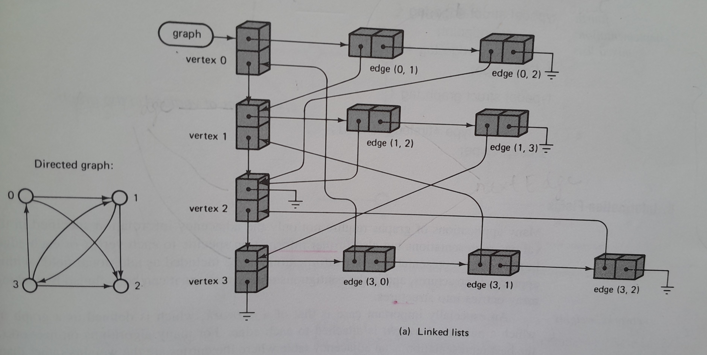

### Graph Theory

**Definition**

A **graph** G consists of a finite set of vertices V, and for all *v* ∊ V, a subset of V, E, called the finite set of vertices adjacent to *v* (edges).  Formally, a graph is denoted as a pair G(V, E) 

Depending on the requirements of the problem or application, graphs can be implemented using different methods, such as adjacency lists, adjacency matrices, or edge lists.

This demo implements a directed graph using linked lists for both the vertices and edges. The following type definitions are declared:

```C

// Forward declaration
typedef struct vertex_tag Vertex_type;
typedef struct edge_tag Edge_type;

// vertex node
struct vertex_tag {
    int label;                      // value serves as a unique identifer
    Edge_type *firstEdge;           // start of the adjacency linked list
    Vertex_type *nextVertex;        // next vertex node on the vertex linked list
};

// adjacency/edge node
struct edge_tag {
    Vertex_type *endPoint;          // vertex node to which the edge points to
    Edge_type *nextEdge;            // next edge node on the adjacency linked list
};

typedef Vertex_type *Graph_type;    // header for the linked list of vertices

```

The above type definitions are from pg 386 of reference 1. Given below is the result of the graph produced by the demo.



<br />
<br />

**Requirements**

A modern ANSI C compiler.

**References**

1) Data Structures and Program Design in C by Robert L. Kruse, Bruce P. Leung, Clovis L. Tondo

2) https://www.geeksforgeeks.org/dsa/introduction-to-graphs-data-structure-and-algorithm-tutorials/
